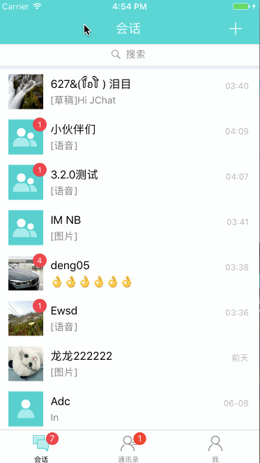
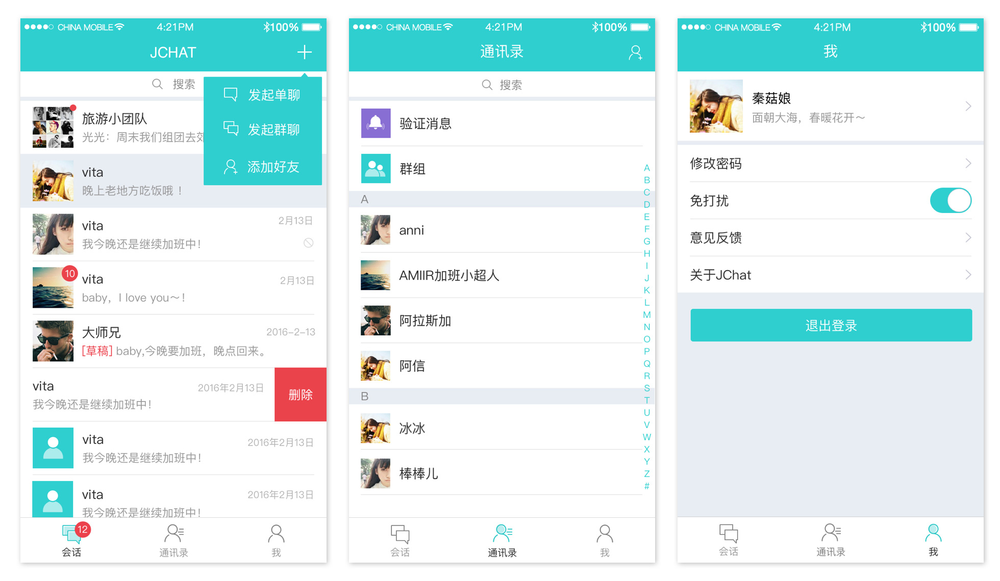

# JChat-Swift

[](https://www.apple.com/nl/ios/)
[](https://developer.apple.com/swift)
[](http://mit-license.org)

		
### 简介

JChat 是基于 JMessage SDK 带有完整 UI 界面的即时通讯应用。 演示了完整的即时通讯功能，包括：

* 单聊、群聊、会话列表、好友、通讯录；
* 支持发送文本、图片、语音、表情、位置、小视频；
* 提供用户管理、群组管理、黑名单、免打扰、消息漫游等功能；

JChat 同时具备好友模式和无好友模式：

* 无好友模式：无需将对方加为好友，通过搜索对方的用户名可直接发起聊天。
* 好友模式：可申请将对方加为好友，对方会收到好友验证，验证通过则互为好友关系。

目前已覆盖 [Android](https://github.com/jpush/jchat-android) 和 iOS 平台，之后将提供 web 版本，开发者可参照 JChat 快速打造自己的 APP，提高开发效率。



### 应用截图



### 环境配置

一、前提：安装 CocoaPods 

在终端输入：

```
sudo gem install cocoapods
```
如果安装成功，会有提示：

```
Successfully installed cocoaPods
```

二、使用 CocoaPods 导入依赖库

在当前工程文件（.xcodeproj）所在文件夹下，打开终端，并执行：

```
pod install（这个可能比较慢，请耐心等待……）
```

### 运行应用

一、打开项目文件 JChat.xcworkspace
	
二、配置运行的基本属性

1. 填写项目工程中的 Bundle Identifier
2. 在 AppDelegate.swift 文件中，按提示填入自己项目的 AppKey。AppKey 是 JMessage SDK 运行的基本参数，如示未获取到应的 AppKey，请到极 [极光官方网站](https://jpush.cn) 登录控制台创建应用获取。

### JMessage 文档

* [JMessage iOS 集成指南](https://docs.jiguang.cn/jmessage/client/jmessage_ios_guide/)
* [JMessage iOS 开发指南](https://docs.jiguang.cn/jmessage/client/im_sdk_ios/)
* [JMessage iOS API Docs](https://docs.jiguang.cn/jmessage/client/jmessage_ios_appledoc_html/)
